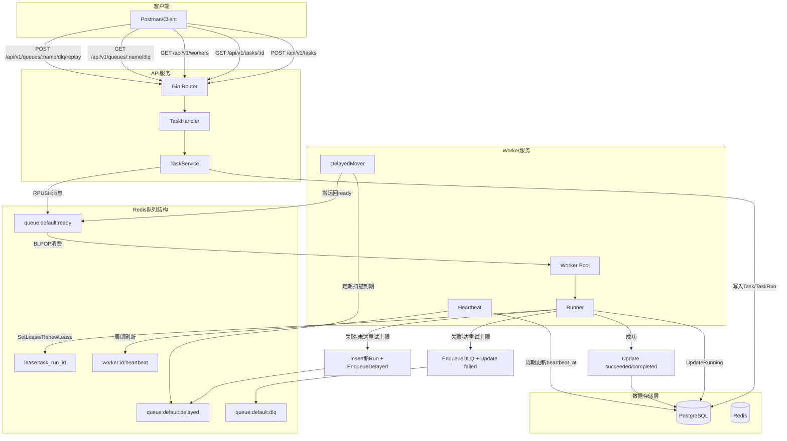

# 分布式任务平台 - 系统执行流程与使用指南

## 一、整体架构流程图



## 二、核心概念说明

### 2.1 Task/TaskRun 模型

- **Task（任务定义）**：描述"要做什么"
  - 字段：id、name、type(immediate/scheduled)、queue_name、priority、payload、max_retries、status、dedup_key
  - 状态流转：pending → queued → completed/failed/cancelled
  
- **TaskRun（执行实例）**：描述"怎么执行"的每次过程
  - 字段：id、task_id、attempt、status、worker_id、started_at、finished_at、result、next_retry_at
  - 状态流转：queued → running → succeeded/failed/retrying/cancelled

### 2.2 可靠性机制

- **租约（Lease）**：绑定某次 TaskRun 的执行权
  - Redis 键：`lease:{task_run_id}` = worker_id，TTL=30s
  - Worker 每 10s 续租，执行结束后释放
  - 避免 Worker 崩溃导致任务丢失或重复执行

- **心跳（Heartbeat）**：Worker 活跃状态信号
  - Redis 键：`worker:{worker_id}:heartbeat`，TTL=30s，每 10s 刷新
  - DB 表：workers.heartbeat_at，每 10s 更新
  - 便于监控与故障发现

- **重试策略**：指数退避
  - 失败时计算 next_retry_at = now + base × 2^(attempt-1)
  - 插入新 TaskRun（attempt+1），消息入 delayed ZSET
  - 搬运器定期将到期消息回填到 ready List

- **死信队列（DLQ）**：达到最大重试后进入
  - Redis 键：`queue:{name}:dlq`
  - 可通过 API 查看与重放

## 三、完整执行流程（按调用链路）

### 3.1 创建即时任务流程

**入口文件**：`cmd/api/main.go`

**调用链路**：
```
Client(Postman)
  ↓ POST /api/v1/tasks
API Router(Gin)
  ↓ handler.CreateTask
TaskHandler
  ↓ taskService.CreateTask
TaskService
  ↓ 1) 幂等检查：repo.FindActiveTaskByDedup
  ↓ 2) 插入Task：repo.InsertTask
  ↓ 3) 插入TaskRun(attempt=1)：repo.InsertTaskRun
  ↓ 4) 入队消息：queue.EnqueueReady → RPUSH queue:default:ready
  ↓ 返回 task_id + status=queued
Client 收到 201 响应
```

**关键步骤说明**：
1. API 收到请求，校验参数（name、type、queue_name、priority、payload、dedup_key、max_retries）
2. Service 层幂等检查：若 dedup_key 命中活跃任务（pending/scheduled/queued），直接返回已有 task_id
3. 插入 Task 记录（status=queued）与首个 TaskRun 记录（attempt=1, status=queued）
4. 构造消息 JSON（task_run_id、task_id、attempt、payload、priority、queue_name、max_retries）
5. RPUSH 到 Redis ready 队列
6. 返回 201 Created + task_id

### 3.2 Worker 消费与执行流程

**入口文件**：`cmd/worker/main.go`

**调用链路**：
```
Worker启动
  ↓ 初始化DB、Redis
  ↓ 注册Worker：repo.InsertWorker → 写入 workers 表
  ↓ 启动心跳goroutine：worker.StartHeartbeat(Redis) + DB心跳
  ↓ 启动延时搬运器：worker.StartDelayedMover
  ↓ 启动并发池：worker.NewPool + pool.Start
  ↓ 主循环：BLPOP queue:default:ready（阻塞等待）
  ↓ 拉到消息后提交到池：pool.Submit(runner.HandleRawMessage)
Runner.handle(并发执行)
  ↓ 1) 置为running：repo.UpdateTaskRunToRunning(worker_id, started_at)
  ↓ 2) 设置租约：lease.SetLease(task_run_id, worker_id, 30s)
  ↓ 3) 启动续租goroutine：每10s RenewLease
  ↓ 4) 执行业务逻辑（示例策略：attempt=1 && priority奇数 → 失败）
  ↓ 5a) 成功分支：
       └→ UpdateTaskRunStatus(succeeded)
       └→ UpdateTaskStatus(completed)
  ↓ 5b) 失败分支：
       └→ UpdateTaskRunStatus(retrying) + 写result/next_retry_at
       └→ 若 attempt >= max_retries：
            └→ EnqueueDLQ + UpdateTaskRunStatus(failed) + UpdateTaskStatus(failed)
       └→ 否则：
            └→ InsertTaskRun(attempt+1) + EnqueueDelayed(next_retry_at)
  ↓ 6) defer：ReleaseLease + UpdateTaskRunFinished(finished_at)
```

**关键步骤说明**：
1. Worker 启动后注册自身到 DB（id、name、queues、capacity），并周期写心跳
2. BLPOP 阻塞消费 ready 队列（超时=0，无限等待）
3. 拉到消息后解析 JSON，提交到并发池（goroutine pool）
4. Runner 置 TaskRun 为 running，设置租约并每 10s 续租
5. 执行业务逻辑（当前示例：奇数优先级首次失败，偶数直接成功）
6. 成功：写 succeeded + completed
7. 失败且未达重试上限：写 retrying、插入新 run、入 delayed ZSET
8. 失败且达重试上限：入 DLQ、写 failed
9. defer 释放租约并写 finished_at

### 3.3 延时队列搬运流程

**入口文件**：`cmd/worker/main.go` 中的 `worker.StartDelayedMover`

**调用链路**：
```
DelayedMover goroutine
  ↓ 每2秒tick一次
  ↓ 遍历监听的队列（如 default）
  ↓ AcquireLock(lock:delayed_moved:default) → 避免多Worker竞争
  ↓ queue.MoveDueDelayedToReadyAtomic
     └→ Lua脚本：ZRANGEBYSCORE delayed -inf now LIMIT 100
     └→ ZREM 移除 + RPUSH 回填到 ready
  ↓ ReleaseLock
  ↓ 被回填的消息被 Worker BLPOP 消费（新一轮执行）
```

### 3.4 DLQ 查看与重放流程

**入口文件**：`cmd/api/main.go`

**调用链路**：
```
Client
  ↓ GET /api/v1/queues/default/dlq?count=50
API Router
  ↓ handler.ListDLQ
  ↓ queue.ListDLQ → LRANGE queue:default:dlq 0 49
  ↓ 返回 items 数组（JSON字符串）

Client
  ↓ POST /api/v1/queues/default/dlq/replay
  ↓ Body: {"count": 1, "override_priority": 2}
API Router
  ↓ handler.ReplayDLQ
  ↓ queue.ReplayDLQWithOverride
     └→ LPOP dlq（从头取count条）
     └→ 解析JSON，覆盖priority（可选）
     └→ RPUSH 回 ready
  ↓ 返回 moved 条数
  ↓ Worker 再次消费并执行
```

## 四、主要 API 接口使用

### 4.1 创建任务

**请求**：
```http
POST /api/v1/tasks
Content-Type: application/json

{
  "name": "demo-task",
  "type": "immediate",
  "queue_name": "default",
  "priority": 2,
  "payload": {"k": "v"},
  "dedup_key": "demo-001",
  "max_retries": 3
}
```

**响应**（201 Created）：
```json
{
  "task_id": "f2841987-0cf0-42e4-bb69-066ad5978c56",
  "status": "queued"
}
```

**字段说明**：
- name：任务名称
- type：immediate（即时任务）或 scheduled（定时任务，第六阶段）
- queue_name：队列名，决定进入哪个 Redis ready 列表
- priority：优先级（当前示例：奇数触发失败，偶数成功）
- payload：任务负载（业务参数），JSON 格式
- dedup_key：去重键，避免重复创建
- max_retries：最大重试次数

### 4.2 查询任务

**请求**：
```http
GET /api/v1/tasks/f2841987-0cf0-42e4-bb69-066ad5978c56
```

**响应**（200 OK）：
```json
{
  "task": {
    "id": "f2841987-0cf0-42e4-bb69-066ad5978c56",
    "name": "demo-task",
    "type": "immediate",
    "queue_name": "default",
    "priority": 2,
    "payload": {"k": "v"},
    "max_retries": 3,
    "status": "completed",
    "dedup_key": "demo-001",
    "created_at": "2025-12-03T21:43:01.716133+08:00",
    "updated_at": "2025-12-03T21:43:01.72028+08:00"
  },
  "latest_run": {
    "id": "794e5855-1b4b-4cbb-9aa8-a42ac4f9ec7b",
    "task_id": "f2841987-0cf0-42e4-bb69-066ad5978c56",
    "attempt": 1,
    "status": "succeeded",
    "worker_id": "dbe2ab88-3733-49a1-9ed0-5bbd2ffc833e",
    "started_at": "2025-12-03T21:43:01.718154+08:00",
    "finished_at": "2025-12-03T21:43:01.721817+08:00",
    "result": null,
    "next_retry_at": null,
    "created_at": "2025-12-03T21:43:01.716935+08:00"
  },
  "display_status": "completed"
}
```

**字段说明**：
- task.status：任务整体状态（queued/completed/failed）
- latest_run.status：最近一次执行状态（queued/running/succeeded/failed/retrying）
- display_status：派生的统一展示状态，便于前端直接使用

### 4.3 查看在线 Worker

**请求**：
```http
GET /api/v1/workers
```

**响应**（200 OK）：
```json
{
  "workers": [
    {
      "id": "3d31e558-56ac-4762-b215-2dfc8e201cbf",
      "name": "worker-3d31e558-56ac-4762-b215-2dfc8e201cbf",
      "queues": ["default"],
      "heartbeat_at": "2025-12-04T15:10:20+08:00",
      "status": "online",
      "capacity": 1
    }
  ],
  "count": 1
}
```

### 4.4 查看死信队列

**请求**：
```http
GET /api/v1/queues/default/dlq?count=50
```

**响应**（200 OK）：
```json
{
  "queue": "default",
  "count": 2,
  "items": [
    "{\"task_run_id\":\"...\",\"task_id\":\"...\",\"attempt\":1,\"payload\":{...},\"priority\":1,\"queue_name\":\"default\",\"max_retries\":1,\"error\":{...}}",
    "..."
  ]
}
```

### 4.5 重放死信队列

**请求**：
```http
POST /api/v1/queues/default/dlq/replay
Content-Type: application/json

{
  "count": 1,
  "override_priority": 2
}
```

**响应**（200 OK）：
```json
{
  "queue": "default",
  "moved": 1
}
```

**说明**：
- count：要重放的条数（从队列头部取）
- override_priority：可选，覆盖消息中的 priority（常用于把奇数改为偶数以便下次成功）

## 五、状态流转示例

### 5.1 成功路径（偶数优先级）

```
POST /api/v1/tasks (priority=2)
  ↓
Task.status = queued
TaskRun(attempt=1).status = queued
  ↓ 消息入 queue:default:ready
Worker BLPOP 消费
  ↓
TaskRun.status = running (写 worker_id, started_at)
  ↓ SetLease + 续租
执行成功（priority=2为偶数，不触发示例失败）
  ↓
TaskRun.status = succeeded
Task.status = completed
  ↓ ReleaseLease + 写 finished_at
GET /api/v1/tasks/{id}
  ↓
display_status = completed
```

### 5.2 失败→重试→成功路径（奇数优先级，max_retries>1）

```
POST /api/v1/tasks (priority=1, max_retries=3)
  ↓
Task.status = queued
TaskRun(attempt=1).status = queued
  ↓ 消息入 queue:default:ready
Worker BLPOP 消费
  ↓
TaskRun(attempt=1).status = running
  ↓ SetLease + 续租
执行失败（priority=1为奇数，attempt=1触发示例失败）
  ↓
TaskRun(attempt=1).status = retrying (写 next_retry_at, result)
TaskRun(attempt=2).status = queued (新插入)
  ↓ 消息入 queue:default:delayed (score=next_retry_at)
DelayedMover 搬运器扫描到期
  ↓ 回填到 queue:default:ready
Worker 再次 BLPOP 消费
  ↓
TaskRun(attempt=2).status = running
  ↓ 执行成功（attempt=2，不再触发失败）
TaskRun(attempt=2).status = succeeded
Task.status = completed
  ↓
GET /api/v1/tasks/{id}
  ↓
display_status = completed
latest_run.attempt = 2
```

### 5.3 达到最大重试→进入DLQ路径

```
POST /api/v1/tasks (priority=1, max_retries=1)
  ↓
Task.status = queued
TaskRun(attempt=1).status = queued
  ↓ 消息入 queue:default:ready
Worker BLPOP 消费
  ↓
TaskRun(attempt=1).status = running
  ↓ 执行失败
attempt=1 >= max_retries=1
  ↓
消息入 queue:default:dlq (携带 error 字段)
TaskRun(attempt=1).status = failed
Task.status = failed
  ↓
GET /api/v1/queues/default/dlq
  ↓ 可看到失败任务
POST /api/v1/queues/default/dlq/replay (override_priority=2)
  ↓ 重放回 ready
Worker 再次消费 → 成功
```

## 六、项目完成度总结

### 已完成部分（约 55%~60%）

- **阶段 0**：项目初始化、配置加载、DB/Redis 连接 ✅
- **阶段 1**：Task/TaskRun 模型与数据库表结构 ✅
- **阶段 2**：最简 API（创建任务、查询任务）✅
- **阶段 3**：Redis 队列接入、基础 Worker 消费 ✅
- **阶段 4**：重试策略、延时队列、DLQ 与重放接口 ✅
- **阶段 5（核心）**：租约、心跳、并发池 ✅
- **阶段 5（增强）**：Worker 元数据入库、在线 Worker API ✅

### 待完成部分（约 40%~45%）

- **阶段 5（增强）**：租约过期自动接管（LeaseReaper）
- **阶段 6**：定时任务 Scheduler + cron（schedules 表与调度服务）
- **阶段 7**：容器化部署（Docker + Nginx + Supervisor）
- **阶段 8**：监控、日志与告警（/metrics、Prometheus）
- **阶段 9**：安全与治理（认证鉴权、限流、审计）
- **阶段 10**：性能优化与功能迭代

## 七、快速验证清单

### Postman 测试步骤

1. **启动服务**：
   - 启动 API：`cd cmd/api && go run main.go`
   - 启动 Worker：`cd cmd/worker && go run main.go`

2. **创建成功任务**（偶数优先级）：
   ```
   POST http://localhost:8080/api/v1/tasks
   Body: {"name":"test-success","type":"immediate","queue_name":"default","priority":2,"payload":{"k":"v"},"dedup_key":"success-1","max_retries":3}
   期望：201 + status=queued
   ```

3. **查询任务状态**：
   ```
   GET http://localhost:8080/api/v1/tasks/{task_id}
   期望：latest_run.status=succeeded, display_status=completed
   ```

4. **创建失败→重试任务**（奇数优先级）：
   ```
   POST http://localhost:8080/api/v1/tasks
   Body: priority=3, max_retries=3
   期望：首次 retrying → 搬运后再次执行 → succeeded
   ```

5. **创建DLQ任务**（奇数优先级 + max_retries=1）：
   ```
   POST http://localhost:8080/api/v1/tasks
   Body: priority=1, max_retries=1
   期望：直接进入 DLQ
   ```

6. **查看DLQ**：
   ```
   GET http://localhost:8080/api/v1/queues/default/dlq?count=50
   期望：返回失败任务列表
   ```

7. **重放DLQ**：
   ```
   POST http://localhost:8080/api/v1/queues/default/dlq/replay
   Body: {"count":1,"override_priority":2}
   期望：moved=1，Worker 再次消费成功
   ```

8. **查看在线Worker**：
   ```
   GET http://localhost:8080/api/v1/workers
   期望：返回当前在线 Worker 列表
   ```

### 数据库检查（PostgreSQL）

```sql
-- 查看所有任务
SELECT id, name, type, status, created_at FROM tasks ORDER BY created_at DESC;

-- 查看某任务的所有运行记录
SELECT attempt, status, worker_id, started_at, finished_at, next_retry_at 
FROM task_runs 
WHERE task_id='YOUR_TASK_ID' 
ORDER BY attempt;

-- 查看在线 Worker
SELECT id, name, queues, heartbeat_at, status, capacity 
FROM workers 
ORDER BY heartbeat_at DESC;
```

### Redis 检查（redis-cli）

```bash
# 查看 ready 队列长度
LLEN queue:default:ready

# 查看 delayed 队列
ZRANGE queue:default:delayed 0 -1 WITHSCORES

# 查看 DLQ 队列
LRANGE queue:default:dlq 0 -1

# 查看某个租约
GET lease:YOUR_TASK_RUN_ID

# 查看某个 Worker 心跳
TTL worker:YOUR_WORKER_ID:heartbeat
```

---

**文档版本**：v1.0  
**最后更新**：2025-12-04  
**适用阶段**：阶段 0~5（含增强）
